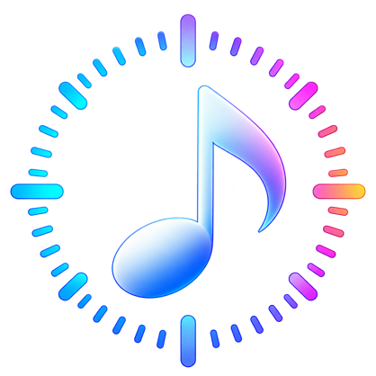

<div align="center">
  

  <h1>TempoLab</h1>

  <p>iPhone・iPad・Macで使える、楽器練習向けのネイティブメトロノーム。</p>
  <p><em>A sample-accurate metronome and tempo detection app built with SwiftUI.</em></p>
</div>

## 概要

TempoLabは、演奏中でも素早く正確に操作できることを目指したメトロノームアプリです。

`AVAudioEngine`と`AVAudioPlayerNode`を使用したサンプル単位のクリック予約、Tap Tempo、アクセントパターン、クリック音のカスタマイズ、マイク入力からの自動テンポ検出を備えています。

音声タイミングはSwiftUIの描画や`Timer`に依存せず、UIスレッドが一時的に忙しい場合もクリック間隔が乱れにくい構成です。

## 主な機能

### メトロノーム

- 30〜300 BPM
- 1 BPM単位で操作できる専用Tempo Control
- `-5` / `-1` / `+1` / `+5`によるテンポ調整
- Touch Downで反応するStart / StopとTap Tempo
- 再生中のBPM変更を次の拍から反映
- バックグラウンドオーディオ

### 拍子・音符単位・アクセント

- 拍子: 2/4、3/4、4/4、5/4、6/8
- 音符単位: 4分音符、8分音符、3連符、16分音符
- 小節内の各ステップをAccent / Normal / Muteへ変更可能
- 現在の再生位置を示すPlayback Indicator

### BPM操作

- 中央インジケータ固定式のカスタムBPM Control
- 慣性や速度補正を使わない正確なドラッグ操作
- 5 BPM / 10 BPM単位のHaptic Feedback（iOS / iPadOS）
- 直近8回までの間隔を使う、外れ値に強いTap Tempo

### クリック音

- Sine / Square / Wood / Digitalの4音色
- Normal Click: 300〜2,000 Hz
- Accent Click: 300〜3,000 Hz
- 音量調整とクリック音プレビュー
- 外部音声ファイルに依存しないPCM波形生成

### 自動テンポ検出

- マイク入力から50〜220 BPMを推定
- Accelerate/vDSPによるFFTとSpectral Flux解析
- Onset Detectionと自己相関によるBPM候補生成
- Confidenceと上位候補の表示
- Half-time / Double-time候補の評価
- 検出結果をメトロノームへ直接適用

### その他

- BPM、拍子、音符単位、アクセント、クリック設定の保存
- 再生中の画面スリープ防止設定（iOS / iPadOS）
- VoiceOverを考慮したAccessibility
- iPhone、iPad、macOSで共有するSwiftUIコード

## 対応環境

- iOS / iPadOS 26.5以降
- macOS 26.5以降
- Xcode 26.5以降
- Swift 5

プロジェクトのDeployment Targetに合わせた値です。利用するXcodeによっては、署名チームやBundle Identifierの変更が必要です。

## セットアップ

```bash
git clone https://github.com/taro252/TempoLab.git
cd TempoLab
open TempoLab.xcodeproj
```

Xcodeで次の手順を実行してください。

1. `TempoLab` Schemeを選択します。
2. 実行先としてiPhone、iPad、またはMacを選択します。
3. 実機で動作させる場合は、Signing & CapabilitiesでDevelopment Teamを設定します。
4. Runボタン、または `⌘R` で起動します。

自動テンポ検出を利用する場合は、初回起動時にマイクアクセスを許可してください。

## アーキテクチャ

軽量なMVVM構成で、画面表示・状態管理・音声処理・DSP処理を分離しています。

```text
SwiftUI Views
    ↓ user action
ViewModels (@MainActor)
    ├── MetronomeEngine
    │     ├── ClickSoundGenerator
    │     └── AVAudioEngine / AVAudioPlayerNode
    │
    └── TempoDetector
          ├── PCM Ring Buffer
          ├── DSP Serial Queue
          └── Accelerate / vDSP
```

### メトロノームのタイミング

クリックはAudio Sample Timeを基準に先行予約します。実際の発音タイミングには、次の仕組みを使用していません。

- `Timer`
- `DispatchSourceTimer`
- `asyncAfter`
- SwiftUI Animation

テンポ変更時も`AVAudioEngine`全体は停止せず、拍位置を維持しながら将来のスケジュールだけを更新します。

### テンポ検出

```text
Microphone PCM
    ↓ Float32 mono downmix
Fixed-size Ring Buffer
    ↓
Hann Window + FFT
    ↓
Spectral Flux
    ↓
Adaptive Onset Detection
    ↓
Autocorrelation
    ↓
BPM Candidates + Confidence
```

重いDSP処理はAudio callback上では実行せず、専用の直列キューで処理します。

## プロジェクト構成

```text
TempoLab/
├── Audio/       # メトロノーム、入力、波形生成、テンポ検出
├── Models/      # 拍子、音符単位、設定、検出結果
├── Services/    # 設定保存、画面スリープ制御
├── Utilities/   # BPM計算、Tap Tempo、Haptics
├── ViewModels/  # UI状態とユーザー操作
└── Views/       # SwiftUI画面・コンポーネント

TempoLabTests/   # XCTestによるUnit Test
```

## テスト

XcodeのTestアクション、または次のコマンドで実行できます。

```bash
xcodebuild test \
  -project TempoLab.xcodeproj \
  -scheme TempoLab \
  -destination 'platform=macOS'
```

主なテスト対象:

- メトロノームのサンプル位置計算
- BPM変更と拍位置の維持
- Tap Tempo
- BPM Controlのドラッグ計算と範囲制限
- クリック波形生成
- Accent Pattern
- 設定の保存・復元
- 44.1 kHz / 48 kHzの合成クリック音によるテンポ検出
- 無音、ノイズ、欠落クリック、Half-time / Double-time

## プライバシー

自動テンポ検出のマイク音声は端末上で処理されます。クラウドへの送信や録音ファイルの保存は行いません。

## 現在の制限

- 自動テンポ検出はフォアグラウンドでの利用を前提としています。
- ルバート、強いシンコペーション、拍頭が曖昧な楽曲では候補が揺れる場合があります。
- メトロノーム再生中にスピーカー音をマイクへ入力すると、クリックを検出する可能性があります。ヘッドフォンの利用を推奨します。
- 楽曲ファイルの読み込み、Beat Grid、Downbeat検出には未対応です。

## コントリビューション

不具合報告や改善案はIssueでお知らせください。Pull Requestを作成する場合は、既存の責務分離とAudio Sample Timeを基準とする設計を維持してください。

## ライセンス

このプロジェクトは[GNU Affero General Public License v3.0](LICENSE)のもとで公開されています。
